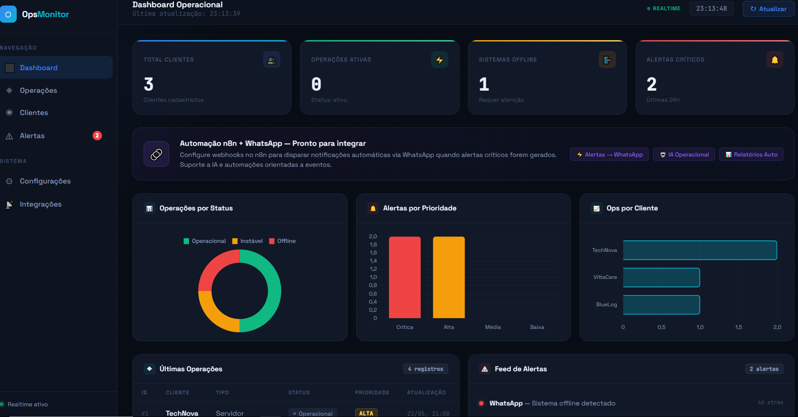

# OpsMonitor 🖥️

> Real-time operational monitoring dashboard built with Vanilla JS, Supabase and Chart.js.


---

## Overview

OpsMonitor is a real-time operational monitoring platform designed to track clients, operations, and alerts through an analytical dashboard. Built from scratch without frameworks to deeply understand how frontend, cloud database, and event-driven automation work together as a unified ecosystem.

**Currently in active development.** New features are added regularly.

---

## Screenshot

> Dashboard preview — live data from Supabase



---

## Features

- **Real-time updates** via Supabase `postgres_changes` — dashboard reflects database changes instantly without page reload
- **KPI Cards** — total clients, active operations, offline systems, and critical alerts
- **Operations Table** — relational JOIN between `operacoes` and `clientes` tables, showing last 20 records
- **Alert Feed** — chronological alert log with urgency indicators
- **3 Analytics Charts** — operations by status (doughnut), alerts by priority (bar), and operations by client (horizontal bar)
- **Mini Metrics Bar** — quick view of pending, error, critical priority, and sent alerts
- **Auto-refresh** — polling every 60 seconds as fallback

---

## Tech Stack

| Layer | Technology |
|---|---|
| Frontend | HTML5, CSS3, Vanilla JavaScript |
| Database | Supabase (PostgreSQL) |
| Realtime | Supabase Realtime (`postgres_changes`) |
| Charts | Chart.js 4.4 |
| Fonts | Space Grotesk + JetBrains Mono |
| Hosting (planned) | Vercel |

---

## Database Schema

```sql
-- Clients
CREATE TABLE clientes (
  id UUID DEFAULT gen_random_uuid() PRIMARY KEY,
  nome TEXT NOT NULL,
  segmento TEXT,
  cidade TEXT
);

-- Operations
CREATE TABLE operacoes (
  id UUID DEFAULT gen_random_uuid() PRIMARY KEY,
  cliente_id UUID REFERENCES clientes(id),
  tipo TEXT,
  status TEXT,         -- 'ativo' | 'pendente' | 'erro' | 'offline' | 'cancelado'
  prioridade TEXT,     -- 'critica' | 'alta' | 'media' | 'baixa'
  ultima_atualizacao TIMESTAMPTZ DEFAULT NOW()
);

-- Alerts
CREATE TABLE alertas (
  id UUID DEFAULT gen_random_uuid() PRIMARY KEY,
  operacao_id UUID REFERENCES operacoes(id),
  mensagem TEXT,
  canal TEXT,
  enviado_em TIMESTAMPTZ DEFAULT NOW()
);
```

---

## Project Structure

```
opsmonitor/
├── index.html      # Markup and layout
├── style.css       # Design system, components and responsive
├── script.js       # Supabase client, charts, realtime logic
└── README.md
```

---

## Getting Started

**1. Clone the repository**
```bash
git clone https://github.com/yourusername/opsmonitor.git
cd opsmonitor
```

**2. Configure Supabase**

In `script.js`, replace with your credentials:
```js
const SUPABASE_URL = 'https://your-project.supabase.co'
const SUPABASE_KEY = 'your-publishable-key'
```

**3. Create the tables**

Run the SQL above in your Supabase SQL Editor and enable Realtime for `operacoes` and `alertas` tables.

**4. Run locally**

Open with [Live Server](https://marketplace.visualstudio.com/items?itemName=ritwickdey.LiveServer) in VSCode or simply open `index.html` in your browser.

---

## Roadmap

- [x] Real-time dashboard with Supabase Realtime
- [x] KPI cards with dynamic data
- [x] Analytical charts (status, priority, clients)
- [x] Relational operations table
- [x] Alert feed
- [ ] n8n integration for workflow automation
- [ ] WhatsApp notifications on critical alerts
- [ ] AI layer for operational analysis
- [ ] Deploy on Vercel
- [ ] Authentication (Supabase Auth)
- [ ] Historical metrics and trends

---

## Architecture

```
Browser (Vanilla JS)
      │
      ├── Supabase JS SDK
      │       ├── REST API  →  PostgreSQL queries
      │       └── Realtime  →  postgres_changes listener
      │
      └── Chart.js  →  Analytics rendering

Future:
      Supabase  →  n8n webhook  →  WhatsApp API
                                →  AI analysis
```

---

## Author

Built as a hands-on learning project in the data field. Every problem solved here is worth more than any course.

---

## License

MIT